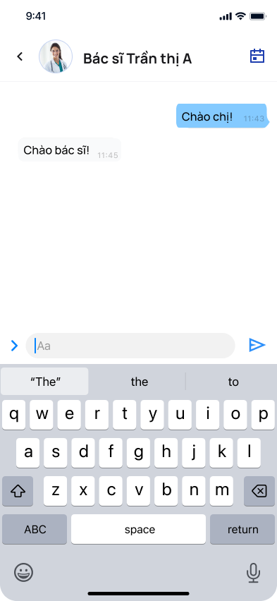

# **Ứng dụng di động Y tế**  
## **Medisync**
---

# **Phase 1: Elicitation Requirement**
### **Khai thác yêu cầu phần mềm**

---
### **Outline:**
**I. Tổng quan dự án (Vision & Scope)**
**II. Kế hoạch thu thập yêu cầu (Requirement Elicitation Plan)**
**III. Tổng hợp và Phân tích yêu cầu (Requirement Analysis & Synthesis)**
**IV. Đặc tả yêu cầu phần mềm (SRS)**
**V. Phân tích đối thủ cạnh tranh (Competitor Analysis)**

---

## **I. Tổng quan dự án (Vision & Scope)**
- **Mục tiêu tổng thể**  
  - Hỗ trợ bệnh viện/trung tâm y tế theo dõi, quản lý và cải thiện sức khỏe  
  - Hợp lý hóa dịch vụ y tế qua kênh số  
  - Cầu nối trực tiếp giữa bệnh nhân và nhà cung cấp dịch vụ y tế  
- **Phạm vi ứng dụng**  
  - Theo dõi sức khỏe cá nhân, lên lịch và quản lý cuộc hẹn khám
  - Đăng ký tiêm chủng, tư vấn y tế từ xa
  - Quản lý hồ sơ sức khỏe điện tử, quản lý thuốc và nhắc nhở

---
- **Đối tượng người dùng chính:**  
  - **Bệnh nhân**
    - Đa dạng trình độ học vấn, kỹ thuật, tuổi >18
  - **Bác sĩ**
    - Có bằng y khoa, chứng chỉ hành nghề
    - Kiến thức kỹ thuật trung bình

---

## **II. Kế hoạch thu thập yêu cầu (Requirement Elicitation Plan)**

*   **Các kỹ thuật:** Phỏng vấn, Khảo sát (form), Nghiên cứu tài liệu, Phân tích ứng dụng tương tự.
*   **Nguồn thông tin:** Bác sĩ, Điều dưỡng/y tá, Bệnh nhân, Dịch vụ bảo hiểm, Cơ quan pháp lý, Bệnh viện, Các ứng dụng cùng ngành.
*   **Kết quả mong đợi:** Biên bản phỏng vấn, dữ liệu khảo sát, tài liệu pháp lý, biên bản họp bệnh viện, tài liệu tổng hợp/so sánh ứng dụng.

---
## **II. Kế hoạch thu thập yêu cầu (Requirement Elicitation Plan)**

*   **Tình trạng tiếp cận:** Đã thực hiện (Bác sĩ, Điều dưỡng, Bệnh nhân, Ứng dụng cùng ngành), Chưa tiếp cận (Dịch vụ bảo hiểm, Bệnh viện).
*   **Lịch trình công việc:** Được mô tả chi thiết trong tài liêu `KeHoachThuThapYeuCau.pdf`
---

## **III. Tổng hợp và Phân tích yêu cầu (Requirement Analysis & Synthesis)**
* **Trọng tâm phân tích:** 
  * Quy trình làm việc lâm sàng
  * Tính năng ưu tiên
  * Yêu cầu tích hợp
  * An toàn & Bảo mật
  * Rào cản triển khai.

---

### **1. Quy trình làm việc lâm sàng:**
|Vai trò|Nhiệm vụ|
|---|---|
|Điều dưỡng| Hỗ trợ bác sĩ, hành chính   Hỗ trợ bệnh nhân   Theo dõi tái khám   Ghi chép hồ sơ (giấy & điện tử).|
|Bác sĩ| Khám từ xa   Đánh giá mức độ nghiêm trọng   Tư vấn nhập viện   Cần truy cập nhanh tiền sử bệnh nhân.|
---

## **2. Tính năng ưu tiên:**
|Vai trò|Tính năng ưu tiên|
|---|---|
|Bác sĩ| - Hồ sơ bệnh án điện tử - Kê đơn điện tử & giao thuốc  - Hỗ trợ kiểm tra tương tác thuốc  - Đánh giá tình trạng khẩn cấp.   - AI hỗ trợ chẩn đoán/ghi chép.|
|Điều dưỡng & Bệnh nhân| - Theo dõi sức khỏe từ xa   - Đặt lịch khám từ xa  - Nhắc nhở tự động (tái khám, tiêm chủng, thuốc)  - Quản lý hồ sơ sức khỏe gia đình - Tự động hóa hồ sơ|
---

## **3. Yêu cầu tích hợp:**
- Hệ thống EMR/EHR
- Nhà thuốc/Đơn vị Dược
- Cơ sở dữ liệu Thuốc
- Hệ thống Bảo hiểm Y tế (tiềm năng)
- Nguồn kiến thức Y tế
---

## **4. An toàn và Bảo mật:**
- Bảo mật dữ liệu bệnh nhân
- Độ chính xác dữ liệu (tránh sai sót từ AI/nhập liệu)
- Hạn chế chẩn đoán từ xa
- An toàn kê đơn (kiểm tra tương tác)
- Xử lý cấp cứu (chỉ cảnh báo)
- Độ ổn định hệ thống

---

## **5. Rào cản triển khai:**

- Quy trình làm việc hiện tại (giấy & điện tử)
- Hạn chế công nghệ (khám thực thể, AI, hướng dẫn cấp cứu)
- Vấn đề kỹ thuật (trục trặc, lỗi, quá tải)
- Sự chấp nhận của người dùng

---

## **IV. Đặc tả yêu cầu phần mềm (SRS)**
- Tổng số yêu cầu về:
  - **Tính năng**: 8 yêu cầu
  - **Tính khả dụng**: 3 yêu cầu
  - **Độ tin cậy**: 3 yêu cầu
  - **Hiệu suất**: 3 yêu cầu
  - **Khả năng hỗ trợ kỹ thuật**: 2 yêu cầu
- Lưu ý: Các yêu cầu này đã được mô tả chi tiết trong tài liệu `SoftwareRequirementsSpecification.pdf`
---

## **V. Phân tích đối thủ cạnh tranh (Competition Analysis)**

- Đã khảo sát các ứng dụng: Long Châu, Pharmacity, eDoctor, UMC Care
- **Điểm mạnh đối thủ**: 
  - Long Châu: tư vấn dược/bán thuốc
  - Pharmacity: công cụ theo dõi sức khỏe
  - eDoctor: khám/xét nghiệm tại nhà
  - UMC Care: liên kết với bệnh viện uy tín

---
### Điểm yếu chung và Cơ hội cạnh tranh
- Thiếu tích hợp sâu với hệ thống bệnh viện lớn
- Thiếu tính tư vấn năng khám chữa bệnh chuyên sâu
- Giới hạn về phạm vi dịch vụ
- Giao diện phức tạp với người lớn tuổi
- Một số ứng dụng chưa có quản lý hồ sơ gia đình

---

# **Phase 2: Modeling**

### Mô hình hóa hệ thông Medisync
---

## **Activity Diagram**

- **Mục đích:** Mô tả luồng hoạt động chính của hệ thống

|Activity|Mô tả|Kí hiệu|
|---|---|---|
|Bệnh nhân gửi yêu cầu tư vấn|Bệnh nhân gửi yêu cầu tư vấn từ xa qua ứng dụng|**A-1**|
|Hệ thống xử lý và thông báo bác sĩ|Hệ thống nhận yêu cầu và thông báo bác sĩ có mặt|**A-2**|
|Chế độ tư vấn video/chat|Bác sĩ và bệnh nhân tham gia tư vấn qua video hoặc chat|**A-3**|
|Kê đơn & kiểm tra tương tác thuốc|Bác sĩ kê đơn thuốc và hệ thống kiểm tra tương tác thuốc|**A-4**|
|Nhắc nhở lịch tái khám/thuốc|Hệ thống gửi nhắc nhở lịch tái khám và uống thuốc|**A-5**|
---

* Lưu ý: *Bản đầy đủ xem chi tiết trong sơ đồ luồng `ActivityDiagram.pdf` và `ActivityDiagram.drawio`*

---

## **Use Case Diagrams**

**Các Use Case chính:**

| Use Case | Tên Use Case                           | Actor                                     |Activity|
|----------|----------------------------------------|-------------------------------------------|---|
| **UC-3**     | Đặt lịch hẹn tư vấn từ xa              | Bệnh nhân (Chính), Hệ thống               |**A-1**|
| **UC-6**     | Quản lý   thuốc và lịch uống thuốc       | Bệnh nhân                                 |**A-5**|
| **UC-9**     | Nhận thông báo lịch hẹn                | Bệnh nhân (Thụ động), Hệ thống            |**A-5**|
| **UC-11**    | Tham gia tư vấn từ xa                  | Bệnh nhân, Bác sĩ, Hệ thống               |**A-3**|
| **UC-12**    | Gửi tin nhắn bảo mật để hỏi về y tế     | Bệnh nhân, Chuyên gia y tế (Phụ), Hệ thống |**A-3**|
| **UC-18**    | Nhận thông báo về các cuộc hẹn mới      | Chuyên gia y tế (Thụ động), Hệ thống       |**A-2**|
| **UC-20**    | Ghi chẩn đoán và kê đơn                | Chuyên gia y tế, Hệ thống                 |**A-4**|
| **UC-22**    | Thực hiện tư vấn từ xa (Chuyên gia y tế)| Chuyên gia y tế, Bệnh nhân (Phụ), Hệ thống |**A-3**|
| **UC-23**    | Trả lời tin nhắn bảo mật từ bệnh nhân  | Chuyên gia y tế, Hệ thống                 |**A-3**|

---

> *NBVT - Minh họa Use Case Diagram chung và các sơ đồ phụ*  

---

## **UI Prototype**
Lưu ý: *Chi tiết prototype đã có trong đường dẫn Figma đính kèm ở project 02*

---

### **Flow-05: Tham gia tư vấn**

|||||
|:---:|:---:|:---:|:---:|
|  |  |||
--- 

### **Flow-06: Care Chat**
||||
|:---:|:---:|:---:|
|  |  ||
--- 

## **Kết luận** 
- Cần ứng dụng hỗ trợ quy trình làm việc của bác sĩ và điều dưỡng
- Cung cấp tính năng tiện lợi cho bệnh nhân
- Tích hợp chặt chẽ với các hệ thống y tế hiện có
- Chú trọng tính chính xác, an toàn, bảo mật dữ liệu
- Nhận thức và giải quyết các hạn chế của công nghệ

